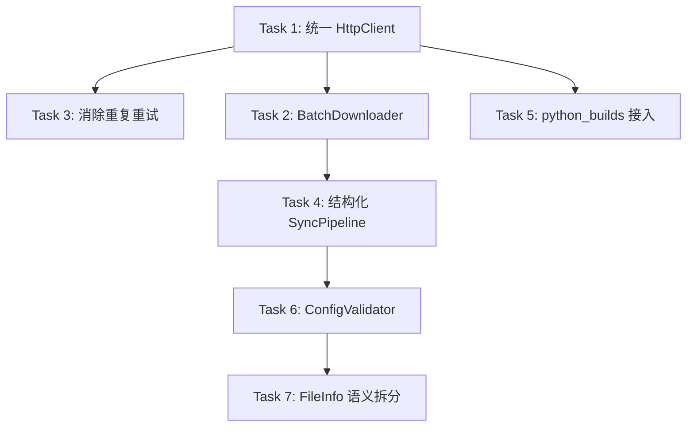

# pip-mirror 架构深化实施计划

> **For agentic workers:** REQUIRED SUB-SKILL: Use superpowers:subagent-driven-development (recommended) or superpowers:executing-plans to implement this plan task-by-task. Steps use checkbox (`- [ ]`) syntax for tracking.

**Goal:** 把当前镜像/重试/sync 区域的浅层模块深化为高 leverage、可单测的模块：统一 HTTP 适配器、结构化 sync pipeline、压平下载流水线、集中配置校验、拆分 FileInfo 语义类型。

**Architecture:** 围绕一个统一的 `HttpClient` seam 重构网络层，让重试/fallback/mirror 策略只存在一处；把 `sync/mod.rs` 从胶水编排改为显式 phase machine；把下载、配置校验、文件元数据分别收拢到独立深模块。依赖方向保持从 CLI → sync → resolver/downloader → HttpClient。

**Tech Stack:** Rust, reqwest + reqwest-middleware, tokio, dashmap, pep440_rs, astral-pubgrub

---

## 1. 模块与文件结构

### 1.1 新增文件

| 文件 | 职责 |
|------|------|
| `src/http/client.rs` | `HttpClient` 适配器：统一 `get_json` / `get_bytes` / `get_stream`，内部挂载 `MirrorRetryMiddleware` 与重试策略。 |
| `src/http/policy.rs` | 重试策略定义：`RetryPolicy`（最大次数、退避、状态码分类、是否 fallback）。 |
| `src/sync/pipeline.rs` | `SyncPipeline` builder：按 phase 组合 plan / filter / download / record / finalize。 |
| `src/sync/phases/plan.rs` | `PlanPhase`：把包名列表转成 `DependencyPlan`。 |
| `src/sync/phases/download.rs` | `DownloadPhase`：封装 `BatchDownloader` 调用与进度上报。 |
| `src/sync/phases/record.rs` | `RecordPhase`：把下载结果写入 `.store.db`。 |
| `src/sync/phases/finalize.rs` | `FinalizePhase`：重建索引与 python-builds。 |
| `src/downloader/batch.rs` | `BatchDownloader`：注入 policy，统一下载入口。 |
| `src/config/validator.rs` | `ConfigValidator`：集中所有配置期校验逻辑。 |
| `src/downloader/file.rs` | `RemoteFile` / `ExplicitWheel` / `Downloadable` trait。 |

### 1.2 修改文件

| 文件 | 变更 |
|------|------|
| `src/lib.rs` | 按需暴露 `http`、`sync::phases`、`downloader::file` 等公开模块。 |
| `src/main.rs` | `INIT_TEMPLATE` 中的注释同步新的 `pypi_urls` 用法。 |
| `src/sync_cmd.rs` | 移除 `cli_packages_to_specs` 中的重复 URL 校验，调用 `ConfigValidator`。 |
| `src/sync/mod.rs` | 删除 `do_sync`/`execute_download_phase`/`run_downloads` 等胶水函数，改为 `SyncPipeline` 组合。 |
| `src/sync/plan.rs` | 删除与 `resolver/plan/mod.rs` 重复的 top-version 选择逻辑，委托给 resolver。 |
| `src/sync/finalize.rs` | 改为 `FinalizePhase` 实现，保持接口。 |
| `src/sync/url_wheel_download.rs` | 使用 `HttpClient::get_bytes`，移除裸 `reqwest::Client` 与 scheme/后缀校验。 |
| `src/python_builds.rs` | 使用 `HttpClient` 替代裸 `reqwest::Client`。 |
| `src/resolver/metadata.rs` | 删除 `fetch_json` 内部重试循环，改为单次 `http.get_json`。 |
| `src/downloader/client.rs` | 把 `MirrorRetryMiddleware` 及策略迁移到 `src/http/`，原位置保留薄 wrapper 或删除。 |
| `src/downloader.rs` | `FileInfo` 改名为 `RemoteFile`，新增 `ExplicitWheel`；下载函数接收 `Downloadable` trait object。 |
| `src/downloader/pipeline.rs` | 逻辑迁移到 `BatchDownloader`，原文件保留薄 wrapper 或删除。 |
| `src/downloader/select.rs` | 输入从 `&[FileInfo]` 改为 `&[RemoteFile]`。 |
| `src/downloader/local.rs` | 输入从 `&FileInfo` 改为 `&dyn Downloadable`。 |
| `src/store.rs` | 记录字段从 `FileInfo` 改为 `RemoteFile` 的核心字段。 |
| `src/indexer.rs` / `src/packager.rs` | 输入从 `FileInfo` 改为 `RemoteFile`。 |
| `src/resolver/metadata_types.rs` | 解析出的文件类型从 `FileInfo` 改为 `RemoteFile`。 |
| `tests/*.rs` | 测试 client 统一从 `reqwest_middleware::ClientBuilder` 改为 `HttpClient`；新增 `http_tests.rs` 覆盖 adapter。 |

### 1.3 删除文件

- `src/downloader/client.rs`（迁移到 `src/http/client.rs` + `src/http/policy.rs`）
- `src/downloader/pipeline.rs`（迁移到 `src/downloader/batch.rs`）
- 若保留 backward compatibility 可暂时保留 thin re-export，计划第二阶段删除。

---

## 2. 执行顺序与依赖



每个 Task 独立完成、独立可测、独立 commit。Task 1 是基础依赖，必须先做。

---

## 3. 关键接口草图

### 3.1 HttpClient

```rust
pub struct HttpClient { ... }

impl HttpClient {
    pub fn builder() -> HttpClientBuilder;
    pub async fn get_json(&self,
        url: &str,
    ) -> Result<serde_json::Value, HttpError>;
    pub async fn get_bytes(
        &self,
        url: &str,
        expected_sha256: Option<&str>,
    ) -> Result<Vec<u8>, HttpError>;
    pub async fn get_stream(
        &self,
        url: &str,
    ) -> Result<impl Stream<Item = Result<Bytes, HttpError>>, HttpError>;
}

pub struct HttpClientBuilder {
    pub fn with_mirrors(self, mirrors: Vec<String>) -> Self;
    pub fn with_retry_policy(self, policy: RetryPolicy) -> Self;
    pub fn build(self) -> Result<HttpClient, HttpClientError>;
}
```

### 3.2 RetryPolicy

```rust
pub struct RetryPolicy {
    pub max_attempts: usize,
    pub backoff_ms: u64,
    pub retry_on_status: fn(StatusCode) -> bool,
    pub retry_on_error: fn(&reqwest::Error) -> bool,
}

impl Default for RetryPolicy {
    fn default() -> Self { ... } // 3 次，100ms，5xx/超时/连接错误
}
```

### 3.3 SyncPipeline

```rust
pub struct SyncPipeline { ... }

impl SyncPipeline {
    pub fn new(config: &Config, client: HttpClient) -> Self;
    pub fn plan(self, pkgs: &[PackageSpec], no_deps: bool) -> PlanPhase;
    pub fn download(self, dry_run: bool) -> DownloadPhase;
    pub fn record(self) -> RecordPhase;
    pub fn finalize(self, download_python_builds: bool) -> FinalizePhase;
    pub async fn run(self, progress: Option<ProgressHandle>) -> Result<SyncOutcome, SyncError>;
}

pub struct SyncOutcome {
    pub downloaded: Vec<RemoteFile>,
    pub skipped: Vec<RemoteFile>,
    pub failed: Vec<(RemoteFile, String)>,
}
```

### 3.4 BatchDownloader

```rust
pub struct BatchDownloader { ... }

impl BatchDownloader {
    pub fn new(
        client: HttpClient,
        repo: &Path,
        store: Option<DownloadStore>,
        policy: DownloadPolicy,
        progress: Option<ProgressHandle>,
    ) -> Self;
    pub async fn download(
        &self,
        files: &[Box<dyn Downloadable>],
        prefetched: &PrefetchedFiles,
    ) -> DownloadResult;
}

pub struct DownloadPolicy {
    pub include_source: bool,
    pub workers: usize,
}
```

### 3.5 Downloadable trait

```rust
pub trait Downloadable: Send + Sync {
    fn filename(&self) -> &str;
    fn sha256(&self) -> Option<&str>;
    fn size(&self) -> Option<u64>;
    fn source_url(&self) -> &str;
    fn dest_path(&self, repo: &Path) -> PathBuf;
    fn is_explicit_url(&self) -> bool;
}

pub struct RemoteFile { ... }   // 来自 PyPI JSON
pub struct ExplicitWheel { ... } // 来自用户 URL
```

### 3.6 ConfigValidator

```rust
pub struct ConfigValidator;

impl ConfigValidator {
    pub fn validate(config: &Config) -> Result<(), ConfigError>;
    pub fn validate_package_url(spec: &PackageUrlSpec) -> Result<(), ConfigError>;
    pub fn validate_mirrors(urls: &[String]) -> Result<(), ConfigError>;
}

pub enum ConfigError {
    InvalidMirror { url: String, reason: String },
    InvalidPackageUrl { url: String, reason: String },
    UrlMistakenForName(String),
    ...
}
```

---


## Task 1: 统一 HTTP 客户端适配器（HttpClient）

**目标：** 消除 `reqwest::Client` 与 `ClientWithMiddleware` 的割裂，把所有网络请求收敛到一个 `HttpClient` seam；重试 / mirror fallback / 退避策略全部下沉到 `src/http/`。

**涉及文件：**
- 创建：`src/http/mod.rs`、`src/http/client.rs`、`src/http/policy.rs`、`src/http/error.rs`
- 修改：`src/lib.rs`、`src/sync/mod.rs`、`src/sync/url_wheel_download.rs`、`src/python_builds.rs`、`src/resolver/metadata.rs`、`src/downloader.rs`
- 测试：新增 `tests/http_tests.rs`

**关键接口草图：**

```rust
// src/http/policy.rs
pub struct RetryPolicy {
    pub max_attempts: usize,
    pub backoff_ms: u64,
    pub retry_on_status: fn(StatusCode) -> bool,
    pub retry_on_error: fn(&reqwest::Error) -> bool,
}

impl RetryPolicy {
    pub fn mirror_default() -> Self { ... } // 3 次、100ms、5xx/超时/连接错误
}

// src/http/client.rs
pub struct HttpClient { inner: reqwest_middleware::ClientWithMiddleware }

impl HttpClient {
    pub fn builder() -> HttpClientBuilder;
    pub async fn get_json(&self, url: &str) -> Result<Value, HttpError>;
    pub async fn get_bytes(&self, url: &str) -> Result<Vec<u8>, HttpError>;
    pub async fn get_text(&self, url: &str) -> Result<String, HttpError>;
}

pub struct HttpClientBuilder { ... }
impl HttpClientBuilder {
    pub fn with_mirrors(self, mirrors: Vec<String>) -> Result<Self, HttpClientError>;
    pub fn with_timeout(self, secs: u64) -> Self;
    pub fn with_policy(self, policy: RetryPolicy) -> Self;
    pub fn build(self) -> Result<HttpClient, HttpClientError>;
}
```

**实施步骤：**

- [ ] **Step 1：设计 `HttpError` 类型**
  在 `src/http/error.rs` 中定义统一错误类型，覆盖：
  - `Timeout`
  - `Connect`
  - `Http { status: u16, url: String }`
  - `Json { url: String, source: String }`
  - `Sha256Mismatch { url: String }`
  - `AllMirrorsFailed { urls: Vec<String> }`
  所有变体在显示时调用 `redact_url_for_display`，避免泄露凭证。

- [ ] **Step 2：迁移 `MirrorRetryMiddleware`**
  把 `src/downloader/client.rs` 中的 `MirrorRetryMiddleware` 迁移到 `src/http/client.rs` 内部作为私有实现。保留行为：
  - 仅对 origin 属于 mirrors 的请求做 rewrite；
  - 每个 mirror 最多尝试 `policy.max_attempts` 次；
  - 非 2xx / 超时 / 连接错误触发重试；
  - 所有 mirror 失败后返回 `HttpError::AllMirrorsFailed`。

- [ ] **Step 3：实现 `HttpClient` 基本方法**
  `get_json` 内部发送请求 → 检查状态码 → `resp.json()`；`get_bytes` 流式读取并限制大小；错误统一包装为 `HttpError`。

- [ ] **Step 4：替换 `build_sync_client`**
  在 `src/sync/mod.rs` 中把 `build_sync_client(mirrors)` 改为返回 `HttpClient`，并在 `do_sync` 中使用。

- [ ] **Step 5：替换 `build_explicit_url_client`**
  在 `src/sync/url_wheel_download.rs` 中删除裸 `reqwest::Client` 构建，使用共享的 `HttpClient`（不带 mirror 策略或显式不带 rewrite）。

- [ ] **Step 6：替换 `python_builds` 中的裸 client**
  在 `src/python_builds.rs` 中使用 `HttpClient::builder().build()`。

- [ ] **Step 7：移除 `MetadataCache` 内部重试**
  在 `src/resolver/metadata.rs` 中把 `fetch_json` 的 3 次循环删掉，改为单次 `http.get_json(&url).await`。

- [ ] **Step 8：新增 `tests/http_tests.rs`**
  覆盖：
  - 单 mirror 500 后重试成功；
  - 多 mirror fallback；
  - 非 mirror origin 的 URL 不被 rewrite；
  - JSON 解析失败被包装为 `HttpError::Json`。

**验收标准：**
- `cargo test` 全量通过。
- `cargo clippy --all-targets -- -D warnings` 无警告。
- 全代码库只剩 `HttpClient` 作为网络入口（不再直接构造 `reqwest::Client` 或 `ClientWithMiddleware`，测试辅助函数除外）。
- `rg "reqwest::Client::new\(\)" src/` 返回空。

**Commit 建议：**
```bash
git add src/http tests/http_tests.rs src/sync/mod.rs src/sync/url_wheel_download.rs src/python_builds.rs src/resolver/metadata.rs src/downloader.rs src/lib.rs
git commit -m "feat(http): 统一 HttpClient 适配器" -m "- 新增 src/http/ 模块封装 reqwest_middleware" -m "- 重试/mirror fallback 策略下沉到 HttpClient" -m "- 替换 build_sync_client/build_explicit_url_client/python_builds 中的裸 client" -m "- 移除 MetadataCache 内部重试循环"
```

---


## Task 2: 压平下载流水线为 BatchDownloader

**目标：** 消除 `downloader.rs`、`pipeline.rs`、`local.rs` 之间的浅层传递，把下载入口收敛为 `BatchDownloader` 深模块。

**涉及文件：**
- 创建：`src/downloader/batch.rs`
- 修改：`src/downloader.rs`、`src/downloader/pipeline.rs`、`src/downloader/local.rs`、`src/downloader/select.rs`、`src/sync/mod.rs`
- 删除或保留 thin re-export：`src/downloader/pipeline.rs`
- 测试：调整 `tests/downloader_tests.rs`、`tests/concurrency_regression_tests.rs`

**关键接口草图：**

```rust
// src/downloader/batch.rs
pub struct BatchDownloader {
    client: HttpClient,
    repo: PathBuf,
    store: Option<DownloadStore>,
    policy: DownloadPolicy,
    progress: Option<ProgressHandle>,
}

pub struct DownloadPolicy {
    pub include_source: bool,
    pub workers: usize,
}

impl BatchDownloader {
    pub fn new(
        client: HttpClient,
        repo: &Path,
        store: Option<DownloadStore>,
        policy: DownloadPolicy,
        progress: Option<ProgressHandle>,
    ) -> Self;

    pub async fn download(
        &self,
        files: &[Box<dyn Downloadable>],
        prefetched: &PrefetchedFiles,
    ) -> DownloadResult;
}
```

**实施步骤：**

- [ ] **Step 1：定义 `DownloadPolicy` 与 `BatchDownloader` 结构**
  在 `src/downloader/batch.rs` 创建结构体，把当前 `DownloadPhaseParams` 中的参数按职责分组。

- [ ] **Step 2：迁移 `run_download_pipeline` 逻辑**
  把 `src/downloader/pipeline.rs` 中的以下行为迁移到 `BatchDownloader::download`：
  - 打开或复用 `DownloadStore`；
  - 按 `include_source` 过滤 pending；
  - 并发下载（`buffer_unordered(workers)`）；
  - 合并 `DownloadOutcome`；
  - 排序结果。

- [ ] **Step 3：迁移 `try_download` / `download_file` 逻辑**
  在 `src/downloader.rs` 中保留纯函数 `download_single` 或类似实现，但把“决定走 prefetched / local / network”的分支收进 `BatchDownloader` 内部私有方法。

- [ ] **Step 4：更新 `local.rs` 接口**
  `copy_local_wheel` 的参数从 `FileInfo` 改为 `&dyn Downloadable`，内部通过 `dest_path()` 定位目标路径。

- [ ] **Step 5：替换 `sync/mod.rs` 调用**
  删除 `run_downloads` / `run_download_phase_or_dry_run` / `execute_download_phase`，改为：
  ```rust
  let downloader = BatchDownloader::new(
      client.clone(), repo, store, policy, progress.clone(),
  );
  let result = downloader.download(&downloadables, &prefetched).await;
  ```

- [ ] **Step 6：更新测试**
  - `tests/downloader_tests.rs` 中 `download_file` / `download_pkg_files_with_prefetched` 的调用改为 `BatchDownloader::download`。
  - `tests/concurrency_regression_tests.rs` 中 `download_pkg_files` 调用点改为 `BatchDownloader`。

**验收标准：**
- `src/downloader/pipeline.rs` 行数降到 50 行以下或删除。
- `BatchDownloader::download` 的接口宽度 ≤ 3 个参数。
- 下载相关测试全部通过。

**Commit 建议：**
```bash
git add src/downloader/batch.rs src/downloader.rs src/downloader/pipeline.rs src/downloader/local.rs src/sync/mod.rs tests/downloader_tests.rs tests/concurrency_regression_tests.rs
git commit -m "feat(downloader): 引入 BatchDownloader 深模块" -m "- 把 pipeline/run_download_tasks/try_download 的浅层传递收敛为 BatchDownloader" -m "- DownloadPolicy 封装 include_source 与 workers" -m "- local.rs 接收 &dyn Downloadable"
```

---


## Task 3: 消除 MetadataCache 与 Middleware 的重复重试

**目标：** 让重试 / fallback / 退避策略只存在一处（`HttpClient` / `src/http/policy.rs`），`MetadataCache` 只做元数据缓存与解析。

**涉及文件：**
- 修改：`src/resolver/metadata.rs`、`src/http/policy.rs`
- 测试：调整 `tests/resolver_regression_tests.rs`、`tests/mirror_retry_tests.rs`

**关键接口草图：**

```rust
// src/resolver/metadata.rs
async fn fetch_json(
    &self,
    url: &str,
    package: &str,
    version: Option<&str>,
) -> Result<serde_json::Value, MetadataError> {
    let _permit = self.sem.acquire().await.expect("semaphore not closed");
    self.http.get_json(url).await.map_err(|e| match e {
        HttpError::Json { .. } => MetadataError::Json { ... },
        HttpError::Http { status, .. } => MetadataError::Http { status, ... },
        _ => MetadataError::Http { status: 0, source: e.to_string(), ... },
    })
}
```

**实施步骤：**

- [ ] **Step 1：把 `HttpClient` 注入 `MetadataCache`**
  修改 `MetadataCache::new(client: HttpClient, base_url: String, metadata_workers: usize)`。

- [ ] **Step 2：删除 `fetch_json` 内部循环**
  移除 `fetch_json` 与 `fetch_json_once`，改为单次 `http.get_json` 调用，错误映射为 `MetadataError`。

- [ ] **Step 3：调整 `RetryPolicy` 覆盖 JSON 解析失败**
  在 `src/http/policy.rs` 中增加 `retry_on_body_error: fn(&serde_json::Error) -> bool`，默认对 body decode error 重试一次（触发 mirror 切换）。

- [ ] **Step 4：更新测试断言**
  `tests/resolver_regression_tests.rs` 中原来断言“JSON 解析失败不重试”的测试需要更新为断言“错误最终来自 HttpClient 包装”。

**验收标准：**
- `src/resolver/metadata.rs` 中不再出现 `for attempt in 0..` 重试循环。
- `MetadataError::Json` 的 `msg` 字段仍不泄露 URL 凭证。
- 全量测试通过。

**Commit 建议：**
```bash
git add src/resolver/metadata.rs src/http/policy.rs tests/resolver_regression_tests.rs
git commit -m "refactor(metadata): 把重试逻辑下沉到 HttpClient" -m "- MetadataCache 只负责单次请求与错误映射" -m "- RetryPolicy 支持对 body decode 错误重试"
```

---

## Task 4: 结构化 SyncPipeline

**目标：** 把 `sync/mod.rs` 从胶水编排改为显式 phase machine，提升 orchestration 的可测性与 locality。

**涉及文件：**
- 创建：`src/sync/pipeline.rs`、`src/sync/phases/mod.rs`、`src/sync/phases/plan.rs`、`src/sync/phases/download.rs`、`src/sync/phases/record.rs`、`src/sync/phases/finalize.rs`
- 修改：`src/sync/mod.rs`、`src/sync/plan.rs`、`src/sync/finalize.rs`、`src/sync_cmd.rs`
- 测试：新增 `tests/sync_pipeline_tests.rs`

**关键接口草图：**

```rust
// src/sync/pipeline.rs
pub struct SyncPipeline {
    config: Config,
    client: HttpClient,
    pkgs: Vec<PackageSpec>,
    no_deps: bool,
    dry_run: bool,
    download_python_builds: bool,
}

impl SyncPipeline {
    pub fn new(config: &Config, client: HttpClient, pkgs: &[PackageSpec]) -> Self;
    pub fn no_deps(self, value: bool) -> Self;
    pub fn dry_run(self, value: bool) -> Self;
    pub fn download_python_builds(self, value: bool) -> Self;
    pub async fn run(
        self,
        progress: Option<ProgressHandle>,
    ) -> Result<SyncOutcome, SyncError>;
}

// src/sync/phases/plan.rs
pub struct PlanPhase;
impl PlanPhase {
    pub async fn run(
        config: &Config,
        client: &HttpClient,
        pkgs: &[PackageSpec],
        no_deps: bool,
        progress: Option<ProgressHandle>,
    ) -> Result<DependencyPlan, SyncError>;
}

// src/sync/phases/download.rs
pub struct DownloadPhase;
impl DownloadPhase {
    pub async fn run(
        config: &Config,
        client: &HttpClient,
        plan: &DependencyPlan,
        dry_run: bool,
        progress: Option<ProgressHandle>,
    ) -> Result<Vec<RemoteFile>, SyncError>;
}

// src/sync/phases/record.rs
pub struct RecordPhase;
impl RecordPhase {
    pub async fn run(
        repo: &Path,
        downloaded: &[RemoteFile],
    ) -> Result<(), SyncError>;
}

// src/sync/phases/finalize.rs
pub struct FinalizePhase;
impl FinalizePhase {
    pub async fn run(
        repo: &Path,
        download_python_builds: bool,
        progress: Option<ProgressHandle>,
    ) -> Result<(), SyncError>;
}
```

**实施步骤：**

- [ ] **Step 1：抽取 `PlanPhase`**
  把 `src/sync/mod.rs` 中的 `build_plan` / `create_sync_plan` 调用逻辑迁移到 `src/sync/phases/plan.rs`。`sync/plan.rs::build_top_only_plan` 直接委托给 `resolver/plan/mod.rs` 处理 top-version 选择。

- [ ] **Step 2：抽取 `DownloadPhase`**
  在 `src/sync/phases/download.rs` 中调用 `BatchDownloader`，处理 `dry_run` 分支，返回已下载文件列表。

- [ ] **Step 3：抽取 `RecordPhase` 与 `FinalizePhase`**
  分别把 `prepare_pending_files` 后的记录逻辑、以及 `finalize_mirror` 逻辑迁移到新文件。

- [ ] **Step 4：实现 `SyncPipeline` builder**
  在 `src/sync/pipeline.rs` 中按顺序调用各 phase，并在 phase 之间上报进度事件。

- [ ] **Step 5：替换 `sync_cmd.rs` 调用**
  `cmd_sync` / `cmd_sync_full` 改为：
  ```rust
  SyncPipeline::new(&config, client, &pkgs)
      .no_deps(no_deps)
      .dry_run(dry_run)
      .download_python_builds(download_python_builds)
      .run(progress)
      .await?;
  ```

- [ ] **Step 6：新增 pipeline 测试**
  `tests/sync_pipeline_tests.rs` 使用 mock HTTP server 覆盖：
  - plan 阶段失败时 pipeline 提前返回；
  - dry_run 跳过 download；
  - 各 phase 进度事件正确发出。

**验收标准：**
- `src/sync/mod.rs` 行数从当前 ~350 降到 ≤ 200。
- `do_sync` 函数消失或被 `SyncPipeline::run` 取代。
- 新增测试覆盖至少一个 phase 的失败路径。

**Commit 建议：**
```bash
git add src/sync/pipeline.rs src/sync/phases src/sync/mod.rs src/sync/plan.rs src/sync/finalize.rs src/sync_cmd.rs tests/sync_pipeline_tests.rs
git commit -m "feat(sync): 引入 SyncPipeline phase machine" -m "- Plan/Download/Record/Finalize 各为独立 phase" -m "- sync/mod.rs 退化为组合器" -m "- sync_cmd 使用 builder API"
```

---


## Task 5: 把 URL / wheel 校验收拢到 ConfigValidator

**目标：** 让配置校验在“信息首次可知”的位置完成，减少运行时防御性检查与重复代码。

**涉及文件：**
- 创建：`src/config/validator.rs`
- 修改：`src/config.rs`、`src/sync_cmd.rs`、`src/sync/url_wheel_download.rs`、`src/wheel_url.rs`
- 测试：调整 `tests/config_tests.rs`

**关键接口草图：**

```rust
// src/config/validator.rs
pub struct ConfigValidator;

#[derive(Debug)]
pub enum ConfigError {
    InvalidMirror { url: String, reason: String },
    InvalidPackageUrl { url: String, reason: String },
    UrlMistakenForName(String),
}

impl ConfigValidator {
    pub fn validate(config: &Config) -> Result<(), ConfigError>;
    pub fn validate_mirrors(urls: &[String]) -> Result<(), ConfigError>;
    pub fn validate_package_url(spec: &PackageUrlSpec) -> Result<(), ConfigError>;
    pub fn looks_like_url(name: &str) -> bool; // 供 CLI 参数转换使用
}
```

**实施步骤：**

- [ ] **Step 1：迁移 `config.rs` 校验逻辑**
  把 `Config::validate_no_url_names`、`Config::validate_url_specs`、`Config::validate_pypi_urls` 的实现迁移到 `src/config/validator.rs`，`Config::validate` 内部调用 `ConfigValidator::validate(self)`。

- [ ] **Step 2：统一错误类型**
  `src/config.rs` 中 `validate` 返回 `Result<(), String>` 保持不变以兼容现有调用；`ConfigValidator` 内部先产生 `ConfigError`，再调用 `display()` 转为中文错误信息。

- [ ] **Step 3：替换 `sync_cmd.rs` 中的 looks_like_url 检查**
  `cli_packages_to_specs` 中复用 `ConfigValidator::looks_like_url`，并返回与 `ConfigError::UrlMistakenForName` 一致的错误提示。

- [ ] **Step 4：移除 `url_wheel_download.rs` 的重复校验**
  删除 `url_wheel_download.rs` 中对 `PackageUrlSpec` 的 scheme/后缀校验（保留大小限制与 sha256 校验，因为它们依赖实际下载内容）。

- [ ] **Step 5：决定 `wheel_url.rs` 是否保留解析时校验**
  `parse_wheel_url` 可以保留轻量格式校验，但不再重复 scheme/后缀规则；若解析失败，错误信息统一为 `ConfigError::InvalidPackageUrl` 风格。

- [ ] **Step 6：更新 `config_tests.rs`**
  把现有基于 `cfg.validate()` 的测试迁移到同时覆盖 `ConfigValidator` 的 3 个公开方法。

**验收标准：**
- `rg "(http://|https://|file://).*\.whl" src/sync/url_wheel_download.rs` 只剩下载相关逻辑，没有 scheme/后缀校验。
- `ConfigValidator::validate_package_url` 覆盖当前所有 URL wheel 校验规则。
- `cargo test --test config_tests` 通过。

**Commit 建议：**
```bash
git add src/config/validator.rs src/config.rs src/sync_cmd.rs src/sync/url_wheel_download.rs src/wheel_url.rs tests/config_tests.rs
git commit -m "feat(config): 集中 URL 与 mirror 校验到 ConfigValidator" -m "- 新增 src/config/validator.rs" -m "- 移除 sync_cmd/url_wheel_download 中的重复校验" -m "- ConfigError 区分 InvalidMirror/InvalidPackageUrl/UrlMistakenForName"
```

---

## Task 6: 拆分 FileInfo 为有语义的 domain types

**目标：** 把当前“到处传递的字段 bag”拆分为 `RemoteFile`、`ExplicitWheel` 与 `Downloadable` trait，降低跨层耦合。

**涉及文件：**
- 创建：`src/downloader/file.rs`
- 修改：`src/downloader.rs`、`src/downloader/select.rs`、`src/downloader/local.rs`、`src/resolver/metadata_types.rs`、`src/sync/url_wheel.rs`、`src/store.rs`、`src/indexer.rs`、`src/packager.rs`
- 测试：调整 `tests/downloader_tests.rs`、`tests/sync_integration_tests.rs`、`tests/concurrency_regression_tests.rs`

**关键接口草图：**

```rust
// src/downloader/file.rs
pub trait Downloadable: Send + Sync {
    fn filename(&self) -> &str;
    fn package_name(&self) -> &str;
    fn version(&self) -> &str;
    fn sha256(&self) -> Option<&str>;
    fn size(&self) -> Option<u64>;
    fn source_url(&self) -> &str;
    fn yanked(&self) -> Option<&str>;
    fn is_explicit_url(&self) -> bool;
    fn dest_path(&self, repo: &Path) -> PathBuf;
}

pub struct RemoteFile { ... }   // 对应原 FileInfo（非 explicit_url）
impl Downloadable for RemoteFile { ... }

pub struct ExplicitWheel { ... } // 对应用户 URL wheel
impl Downloadable for ExplicitWheel { ... }

pub enum DownloadableItem {
    Remote(RemoteFile),
    Explicit(ExplicitWheel),
}

impl Downloadable for DownloadableItem { ... }
```

**实施步骤：**

- [ ] **Step 1：定义 trait 与类型**
  在 `src/downloader/file.rs` 中定义 `Downloadable`、`RemoteFile`、`ExplicitWheel`，并实现 `DownloadableItem` enum。

- [ ] **Step 2：迁移 `FileInfo` 字段**
  `RemoteFile` 字段与原 `FileInfo` 基本一致，但 `explicit_url` 固定为 `false`；`ExplicitWheel` 字段从 `PackageUrlSpec` 与 `parse_wheel_url` 结果映射而来。

- [ ] **Step 3：更新 metadata_types 解析**
  `src/resolver/metadata_types.rs` 中从 PyPI JSON 构建 `RemoteFile` 列表。

- [ ] **Step 4：更新 sync/url_wheel 转换**
  `src/sync/url_wheel.rs` 中把 `PackageUrlSpec` 转成 `ExplicitWheel`。

- [ ] **Step 5：更新 downloader 函数签名**
  `src/downloader.rs`、`src/downloader/select.rs`、`src/downloader/local.rs` 中下载相关函数接收 `Box<dyn Downloadable>` 或 `&dyn Downloadable`。`select_files_for_version` 仍接收 `&[RemoteFile]`（因为 resolver 阶段不会有显式 URL wheel）。

- [ ] **Step 6：更新 store / indexer / packager**
  这些模块只使用 `Downloadable` 的 `filename`、`package_name`、`version`、`sha256` 等接口，不再直接依赖 `FileInfo`。

- [ ] **Step 7：更新 DependencyPlan**
  `DependencyPlan.planned_files` 类型从 `Vec<FileInfo>` 改为 `Vec<DownloadableItem>` 或 `Vec<Box<dyn Downloadable>>`。考虑到序列化/克隆需求，也可用 `Vec<DownloadableItem>`。

- [ ] **Step 8：更新测试**
  所有构造 `FileInfo` 的测试改为构造 `RemoteFile` 或 `ExplicitWheel`。

**验收标准：**
- `src/downloader.rs` 中不再定义 `FileInfo` struct（或仅保留 type alias / re-export 以兼容测试过渡）。
- `store.rs` / `indexer.rs` / `packager.rs` 不直接引用 `FileInfo`。
- 全量测试通过。

**Commit 建议：**
```bash
git add src/downloader/file.rs src/downloader.rs src/downloader/select.rs src/downloader/local.rs src/resolver/metadata_types.rs src/sync/url_wheel.rs src/store.rs src/indexer.rs src/packager.rs tests/downloader_tests.rs tests/sync_integration_tests.rs tests/concurrency_regression_tests.rs
git commit -m "refactor(downloader): 拆分 FileInfo 为 RemoteFile 与 ExplicitWheel" -m "- 新增 Downloadable trait 与 DownloadableItem enum" -m "- resolver 产出 RemoteFile，url_wheel 产出 ExplicitWheel" -m "- store/indexer/packager 只依赖 Downloadable 接口"
```

---


## 7. 自我审查

### 7.1 Spec 覆盖检查

| 架构候选 | 对应 Task | 覆盖点 |
|----------|-----------|--------|
| 统一 HTTP 适配器 | Task 1 | HttpClient seam、RetryPolicy、替换所有裸 reqwest |
| BatchDownloader | Task 2 | DownloadPolicy、BatchDownloader::download、参数收敛 |
| 消除重复重试 | Task 3 | MetadataCache 移除循环、RetryPolicy 支持 body decode |
| SyncPipeline | Task 4 | Phase machine、builder API、sync/mod.rs 退化 |
| ConfigValidator | Task 5 | 集中校验、ConfigError、移除运行时重复检查 |
| FileInfo 拆分 | Task 6 | Downloadable trait、RemoteFile/ExplicitWheel |

### 7.2 Placeholder 扫描

- 无 "TBD" / "TODO" / "implement later"。
- 无 "add appropriate error handling" 等模糊描述。
- 每个 Task 的 Step 都是可执行动作，并给出文件路径与接口草图。
- 未写完整实现代码，符合 AGENTS.md 要求。

### 7.3 类型一致性检查

- `HttpClient` 在 Task 1 定义后，Task 2/3/4/5 中调用签名一致。
- `RemoteFile` / `Downloadable` 在 Task 6 定义，Task 2/4 中 `BatchDownloader` 与 `DownloadPhase` 的入参同步为 `Box<dyn Downloadable>` 或 `DownloadableItem`。
- `ConfigError` 在 Task 5 定义，Task 4 的 `SyncError` 若需聚合配置错误，应通过 `From<ConfigError>` 转换（可在实现时补充）。

### 7.4 风险与回退

- **Task 6 影响面最大**：涉及 resolver、downloader、store、indexer、packager。建议作为最后一个 Task，且保留 `FileInfo` 的 type alias 作为过渡，避免一次改动过大。
- **Task 4 与 Task 2 的顺序**：Task 4 依赖 Task 2 的 `BatchDownloader`；若 Task 2 延期，Task 4 可先用现有 `download_pkg_files_with_prefetched` 包装，后续再替换。
- **向后兼容**：`HttpClient` 替换 `ClientWithMiddleware` 后，公开 crate API 可能变化；`lib.rs` 中公开接口需同步调整。

---

## 8. 执行移交

**Plan complete and saved to `docs/superpowers/plans/2026-06-14-architecture-deepening.md`.**

Two execution options:

**1. Subagent-Driven (recommended)** - I dispatch a fresh subagent per task, review between tasks, fast iteration

**2. Inline Execution** - Execute tasks in this session using executing-plans, batch execution with checkpoints

**Which approach?**

